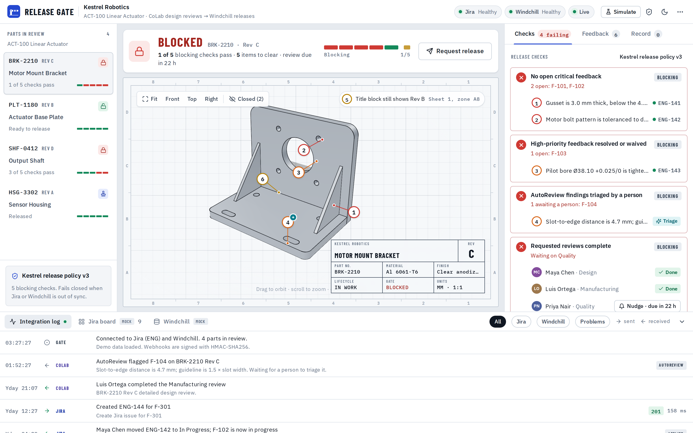
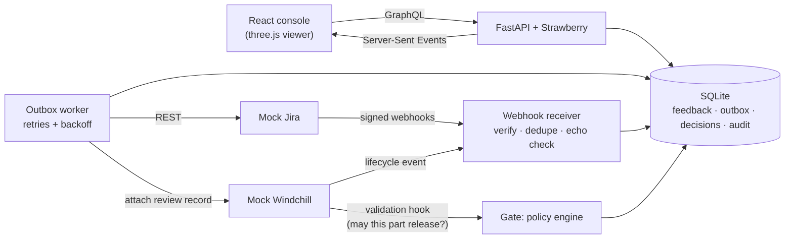

# Release Gate

**A CoLab integration concept: Windchill can't release a part until its CoLab design review says it's ready.**

When the review isn't done, the engineer sees exactly why. When it is, the release goes through and a review record is attached to the part in Windchill. Feedback stays in sync with Jira in both directions the whole time.



Built as a concept demo for CoLab's Workflows team, which makes CoLab fit into the way engineering teams already work. CoLab already syncs review comments with Jira and attaches review summaries back in PLM; this takes the next step and makes the release itself depend on the review. Jira and Windchill are mocks, but they talk to the gate over real HTTP with signed webhooks, and the integration handles the failures a real one has to: outages, lost responses, duplicate and out-of-order webhooks, and its own echoes.

## Run it

```bash
./demo.sh
```

That creates a virtualenv on the first run, starts one Python process (console, GraphQL API, mock Jira, mock Windchill) and opens http://127.0.0.1:8000. Every start resets the demo data. You need **Python 3.10+** (macOS ships 3.9, so use `brew install python@3.12` or [uv](https://docs.astral.sh/uv/)). The built console is committed in `web/dist`, so Node is only needed to change the frontend.

No Python handy? Open `web/dist-offline/index.html` in Chrome. It's the same console with the backend simulated in the browser, in one file you can send to anyone. Both builds are committed on purpose.

## The demo in six clicks

1. **Request release** while it's blocked. Windchill asks the gate first; the gate says no and lists why.
2. Click balloon **1** and **Resolve** it. The note and the status go to Jira; Jira's echo is ignored.
3. Open **Jira board** and move **ENG-142** to Done. The webhook resolves balloon 2 in CoLab.
4. Open balloon **4** (an AutoReview finding) and **Dismiss** it with a reason. **Waive** balloon 3.
5. On **Checks**, **Nudge** Priya for the Quality review.
6. **Release Rev C.** Windchill asks, the gate approves, Windchill confirms, the review record is attached.

Then reset (··· menu), turn on a **Simulate** switch, and do it again.

## How it works



- **Release policy as data.** [`shared/policy.json`](shared/policy.json) defines the checks: no open critical feedback (no waivers), high-priority feedback resolved or waived, AutoReview findings triaged by a person, requested reviews complete, and Jira and Windchill in sync. The engine is pure functions ([`policy.py`](server/releasegate/policy.py)), with a TypeScript port for the browser build; both run the same test vectors in [`shared/policy_cases.json`](shared/policy_cases.json).
- **Transactional outbox.** A change and the message that tells Jira about it commit together. A worker delivers messages with exponential backoff and jitter, honours `Retry-After`, keeps per-issue ordering, and dead-letters what can't succeed. See [`outbox.py`](server/releasegate/outbox.py).
- **Idempotent writes without idempotency keys.** Jira doesn't have them, so every issue carries the CoLab feedback ID in a custom field and the connector searches before it creates. Comments carry a marker so a retry can't post twice. See [`handlers.py`](server/releasegate/handlers.py).
- **Webhooks you can trust.** HMAC-SHA256 signatures, de-duplication by delivery ID, out-of-order events ignored by timestamp, and echoes of our own writes recognised by the integration's service account. See [`webhooks.py`](server/releasegate/webhooks.py).
- **Fails closed.** The gate won't approve while any change is unconfirmed, Windchill holds a promotion if the gate doesn't answer, and a part only shows Released after Windchill confirms the lifecycle change.
- **A record you can audit.** Every decision stores the checks, and approvals attach a review record to the part in Windchill with a SHA-256 hash of its canonical JSON.

More detail and tradeoffs: [docs/ARCHITECTURE.md](docs/ARCHITECTURE.md).

## Stack

| | |
|---|---|
| Backend | Python 3.10+, FastAPI, Strawberry GraphQL, SQLAlchemy 2 (SQLite), httpx |
| Frontend | React 18, TypeScript, Vite, three.js, Zustand |
| Tests | pytest (36 tests), Vitest (shared policy vectors), Playwright (full demo path) |

## Tests

```bash
# once (if demo.sh set up .venv with uv: VIRTUAL_ENV=.venv uv pip install -r server/requirements-dev.txt)
.venv/bin/pip install -r server/requirements-dev.txt
.venv/bin/python -m playwright install chromium

(cd server && ../.venv/bin/python -m pytest -q)                  # 36 backend tests
(cd web && npm ci && npm test)                                   # TypeScript policy engine, same vectors
.venv/bin/python e2e/demo_flow.py --url http://127.0.0.1:8000    # needs a fresh ./demo.sh running
.venv/bin/python e2e/demo_flow.py --url "file://$PWD/web/dist-offline/index.html" --chaos
```

The e2e script drives the demo path in Chromium, including the Jira outage scenario with `--chaos`, and saves a screenshot per step to `e2e/shots`.

## Layout

```
shared/        seed scenario, release policy, policy test vectors (used by both engines)
server/        FastAPI app: policy, outbox, connectors, webhooks, GraphQL, mock Jira and Windchill
web/           React console; src/engine is the in-browser engine for the single-file build
e2e/           Playwright script that runs the demo end to end
docs/          architecture notes and the README screenshot
```

Useful URLs while it runs: `/graphql` (GraphiQL), `/api/docs` (REST), `/mock/jira/rest/api/2/search?jql=project=ENG`, `/mock/windchill/Windchill/servlet/odata/ProdMgmt/Parts`.

## Scope

This is a concept. The Jira and Windchill mocks implement only what the integration uses, in the shape of their real APIs (Jira REST v2, Windchill REST Services OData) but not faithfully. The parts, people and company are invented. Not affiliated with CoLab, Atlassian or PTC.

By Jaineel Patel, built with Claude.
